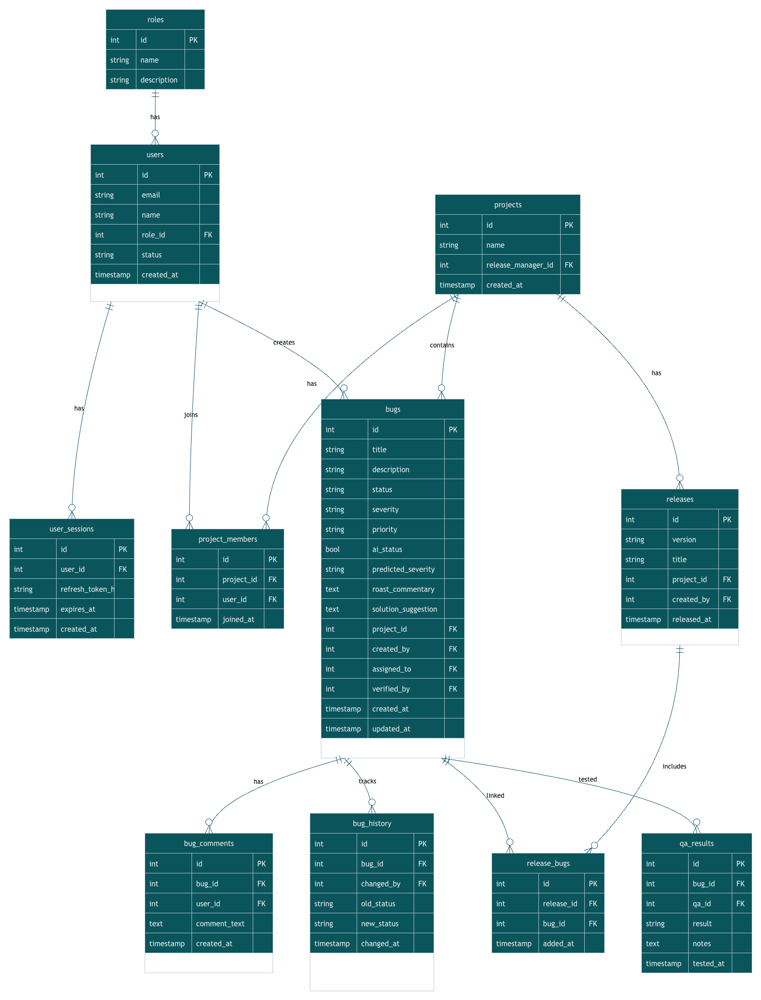

# BugChetana 🐞
**A role-based bug tracking web app with AI-assisted severity prediction and Roast Mode**

<p align="center">
  
</p>

## 📌 What is this project?
BugChetana is an AI-powered role-based bug tracking platform that predicts where bugs are likely to occur, classifies defects by severity, and monitors release quality. It streamlines workflows across Developers, QA Engineers, and Release Managers to act as an intelligent early-warning system for software engineering teams. 

**Bonus Feature:** It also has a **"Roast" mode**. When you submit code, you get the same serious ML-backed analysis wrapped in sarcastic AI commentary generated by Llama 3.

---

### 🛠 Tech Stack
- **Backend:** Python, Django REST Framework
- **Database:** PostgreSQL (configured via Django) / SQLite (currently in repo)
- **Frontend:** React 19, Vite, TailwindCSS
- **Infrastructure:** Docker (Standalone Dockerfiles for frontend/backend)
- **AI/ML:** XGBoost (Severity Prediction), Groq API (Llama 3 for Roast Mode)
- **Auth:** JWT (`djangorestframework-simplejwt`) + Role-Based Access Control (RBAC)

---

## 👥 Features by Role

### 💻 Developer
- **Bug Submission:** Submit new bug reports and view predictions.
- **Dashboard:** View personalized dashboard and bug history.
- **Roast Mode:** Receive sarcastic and helpful feedback on submitted code.

### 🧪 QA (Quality Assurance)
- **Bug Management:** View all bug reports for a project and create bug lists.
- **Testing:** Submit QA results (Pass, Fail, Blocked, Verified, Reassign).
- **Dashboard:** Monitor project bug lists and view QA/Developer history.

### 🚀 Release Manager
- **Project Administration:** Manage projects, assign users, and update user roles.
- **Release Management:** Create releases, attach bugs to releases, and monitor overall release quality.
- **Dashboard:** View high-level metrics, team activity, and system health.

---

## 🏗 Project Structure

```text
.
├── bugchetana_backend/       # Django REST API
│   ├── accounts/             # Users, Roles, JWT Authentication
│   ├── bugs/                 # Bug tracking, Comments, QA Results, Releases
│   ├── projects/             # Project and Member management
│   ├── ai_integration/       # XGBoost prediction & Groq Llama 3 API
│   └── API_DOCUMENTATION.md  # Detailed API endpoint docs
└── bugchetana-frontend/      # React & Vite SPA
    └── src/
        ├── components/       # Reusable UI & Layouts
        └── pages/            # Role-specific views (developer/, qa/, release-manager/)
```

---

## 🚀 Setup Instructions

### 1. Backend (Django)
```bash
cd bugchetana_backend
python3 -m venv .venv
source .venv/bin/activate
pip install -r requirements.txt
```

Create a `.env` file in `bugchetana_backend/` with the following variables:
```env
SECRET_KEY=your_secret_key
DEBUG=True
GROQ_API_KEY=your_groq_api_key
```

Run migrations and start the server:
```bash
python3 manage.py migrate
python3 manage.py runserver
```

### 2. Frontend (React/Vite)
Open a new terminal:
```bash
cd bugchetana-frontend
npm install
npm run dev
```

---

## 🔌 API Overview
BugChetana uses a RESTful architecture. For full details, see the [`API_DOCUMENTATION.md`](bugchetana_backend/API_DOCUMENTATION.md) in the backend directory. High-level groups include:
- **Auth:** `/accounts/register/`, `/accounts/login/`, `/accounts/login/refresh/`
- **Dashboards:** `/bugs/dashboard/developer/`, `/bugs/dashboard/qa/`, `/bugs/projects/<id>/dashboard/`
- **Bugs:** `/bugs/projects/<id>/bugs/`, `/bugs/<id>/verify/`, `/bugs/<id>/assign/`
- **Projects & Users:** `/projects/`, `/accounts/users/`, `/accounts/roles/`

---

## ⚠️ Known Limitations
- **OAuth Not Implemented:** While planned, GitHub and Google OAuth are not currently active in the backend; standard Email/Password + JWT is used.
- **Unified Docker Setup:** Currently, frontend and backend have separate `Dockerfile`s, but there is no unified `docker-compose.yml` orchestrating the entire stack with PostgreSQL automatically.
