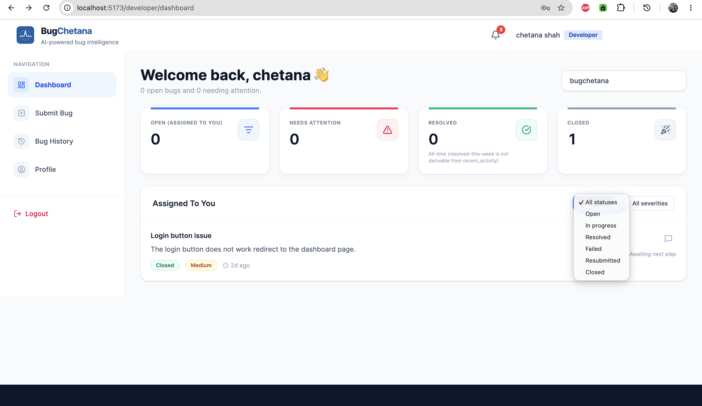
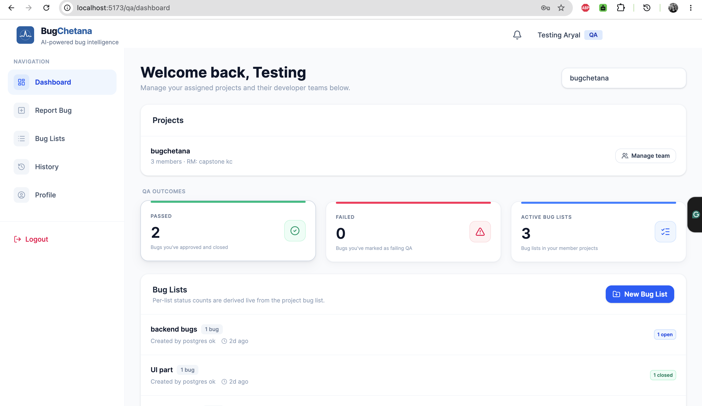
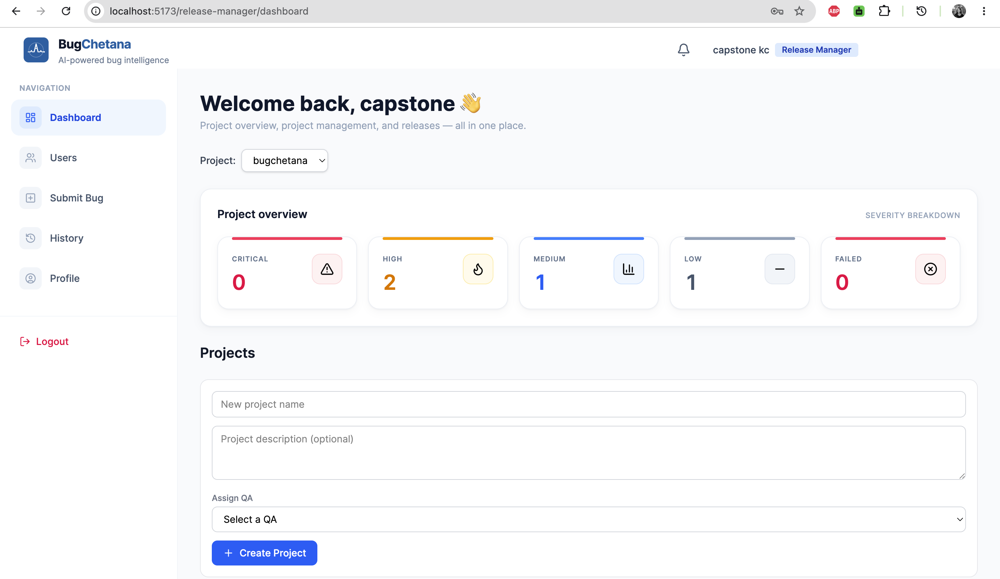

# BugChetana
A role-based bug tracking web application with AI-assisted severity prediction.

## Live Demo
- **Production URL**:📍 https://bug-chetana-ai.vercel.app 
- *Note: The frontend is deployed on Vercel, and the backend is deployed on Railway.*

## Features
- **Bug lifecycle workflow**: Track bugs from initial submission through testing and final verification so nothing slips through the cracks.
- **Role-based access**: Ensure users only see and interact with what is relevant to their job, whether they are fixing code, testing features, or managing releases.
- **AI-assisted bug review**: Receive automated, sometimes sarcastic feedback (Roast Mode) on bug submissions to encourage better reporting habits.
- **Severity prediction**: Automatically estimate how critical a bug is right when it's reported, helping teams prioritize their workload efficiently.
- **Bug history timeline**: Keep a clear record of when a bug was reported, tested, and resolved for full accountability.

## Roles & who does what
- **Developer**: Can submit new bug reports, view severity predictions, receive AI feedback on their submissions, and monitor their personalized dashboard.
- **QA (Quality Assurance)**: Responsible for managing bug reports across a project, submitting test results (Pass, Fail, Blocked, Verified, Reassign), and keeping track of the project's overall bug lists.
- **Release Manager**: Holds administrative control to manage projects, assign user roles, group bugs into targeted releases, and monitor the overall health of those releases.

## Getting started (for developers)

### Prerequisites
- Docker and Docker Compose installed on your machine.
- Git.

### Setup Steps
1. **Clone the repository:**
   ```bash
   git clone <repository-url>
   cd BugChetana
   ```

2. **Configure Environment Variables:**
   Copy the example environment variables file in the root directory and fill in your keys.
   ```bash
   cp .env.example .env
   ```
   You will need to provide values for variables like `SECRET_KEY` and `GROQ_API_KEY`. Reference `.env.example` for the complete list of required keys. Never commit your actual secrets.

3. **Run with Docker Compose:**
   Start the database, backend API, and frontend development server all at once using Docker Compose:
   ```bash
   docker compose up --build
   ```

4. **Access the Application locally:**
   - **Frontend:** http://localhost:5173
   - **Backend API:** http://localhost:8000
   - **Database (PostgreSQL):** Exposed on localhost port 5433

## Tech stack
- **Frontend**: React 19, Vite, TailwindCSS 4, React Router DOM, Axios
- **Backend**: Python, Django 6, Django REST Framework
- **Database**: PostgreSQL 15
- **AI / ML**: XGBoost (Severity Prediction), Groq API (AI Review/Roast Mode)
- **Infrastructure**: Docker & Docker Compose

## Screenshots

### Developer Dashboard


### QA Dashboard


### Release Manager Dashboard


## License

This project is licensed under the MIT License — see [LICENSE](LICENSE) for details.

## Contact

Anuja Khatri — [GitHub](https://github.com/Anujakhatri)
